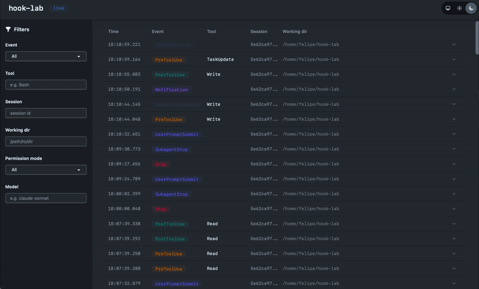
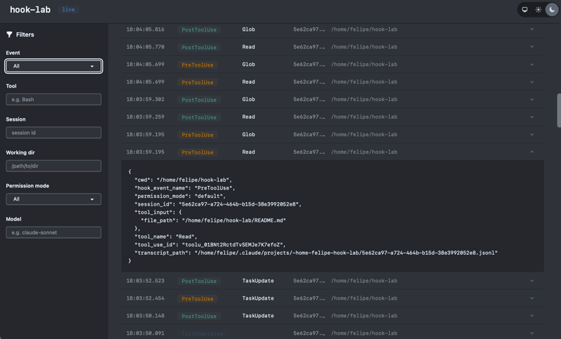

# HookLab

A web dashboard for watching Claude Code hook events in real time.





## Quickstart

```bash
export SECRET_KEY_BASE=$(openssl rand -base64 64)

docker run -d \
  -p 4000:4000 \
  -v hook_lab_data:/app/data \
  -e SECRET_KEY_BASE \
  -e DATABASE_PATH=/app/data/hook_lab.db \
  -e PHX_HOST=localhost \
  ghcr.io/felipeelias/hook-lab:latest
```

Open http://localhost:4000.

## Hook configuration

This repo includes a [`.claude/settings.json`](.claude/settings.json) that sends every hook event to HookLab over HTTP. Each hook has a 1-second timeout. If HookLab isn't running, Claude Code moves on.

Copy the `hooks` block from that file into `~/.claude/settings.json` or your project's `.claude/settings.json`. Here's a stripped-down version with just two events if you want to start small:

```json
{
  "hooks": {
    "PreToolUse": [
      {
        "hooks": [
          {
            "type": "http",
            "url": "http://localhost:4000/api/hooks",
            "timeout": 1
          }
        ]
      }
    ],
    "PostToolUse": [
      {
        "hooks": [
          {
            "type": "http",
            "url": "http://localhost:4000/api/hooks",
            "timeout": 1
          }
        ]
      }
    ]
  }
}
```

Hook settings are read at session start, so open a new Claude Code session after changing them.

## Development

```bash
mix setup
mix phx.server
# http://localhost:4000
```

```bash
mix ci
```

```bash
docker compose build
SECRET_KEY_BASE=$(openssl rand -base64 64) docker compose up
```
